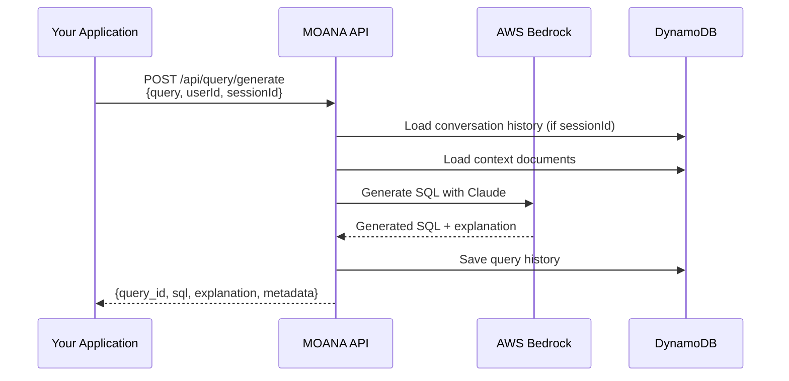
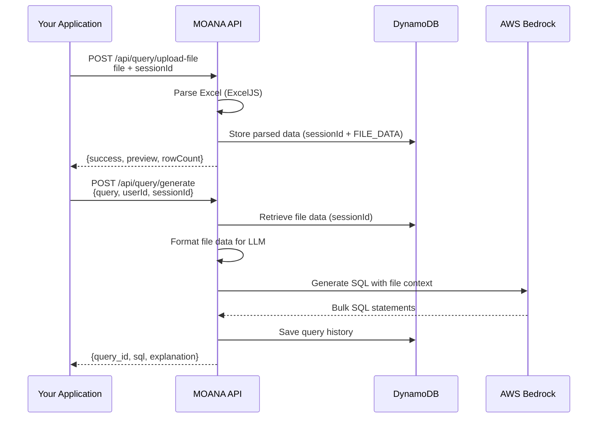
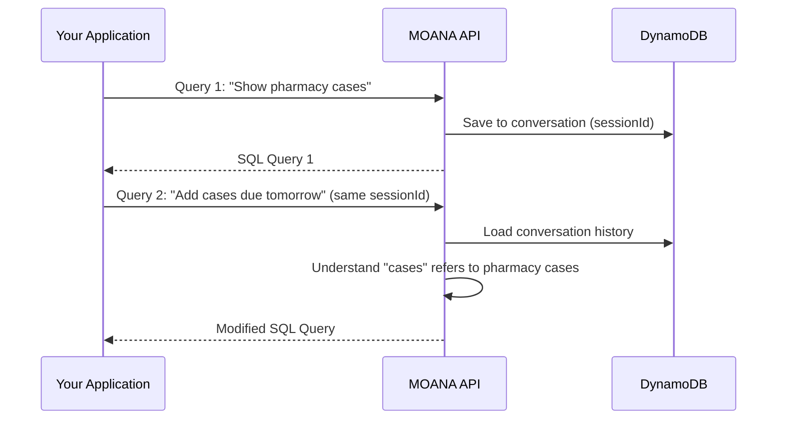

# MOANA API - External Application Integration Guide

**Version:** 1.0.1  
**Last Updated:** February 2, 2026  
**Status:** Production Ready

---

## 📋 Table of Contents

1. [Overview](#overview)
2. [Production URL Setup](#production-url-setup)
3. [Quick Start](#quick-start)
4. [Authentication & Security](#authentication--security)
5. [Integration Flow](#integration-flow)
6. [API Endpoints Reference](#api-endpoints-reference)
7. [Excel File Integration](#excel-file-integration)
8. [Code Examples](#code-examples)
9. [Error Handling](#error-handling)
10. [Rate Limits & Best Practices](#rate-limits--best-practices)
11. [AWS Infrastructure Details](#aws-infrastructure-details)
12. [Testing & Debugging](#testing--debugging)

---

## Overview

### What is MOANA?

**MOANA** (MHK Operating Assistant with Natural AI) is an intelligent SQL query generator that converts natural language questions and Excel file data into accurate MySQL queries using AWS Bedrock with Claude Sonnet 4.5.

### Key Capabilities

- ✅ **Natural Language to SQL**: Convert plain English questions to MySQL queries
- 📊 **Excel File Processing**: Upload XLSX/CSV files for bulk SQL generation
- 🧠 **Context-Aware**: Understands healthcare domain (DER, Grievances, Appeals, IRE)
- 🔄 **Conversational**: Maintains session context for follow-up questions
- 📈 **Bulk Operations**: Generate INSERT/UPDATE statements from Excel data
- 🎯 **High Accuracy**: Uses domain-specific context documents

### Use Cases

1. **Data Migration**: Upload Excel files to generate bulk INSERT statements
2. **Report Generation**: Ask questions about data to get SELECT queries
3. **Data Updates**: Generate UPDATE statements from Excel change logs
4. **Query Assistance**: Get help writing complex JOIN queries
5. **Bulk Operations**: Create transaction-wrapped batch operations

---

## Production URL Setup

### Getting Your Production API URL

After deploying MOANA via Terraform, get your API URL using one of these methods:

**Method 1: Terraform Output**
```bash
cd moana-app/terraform
terraform output alb_dns_name
# Output: moana-prod-alb-1234567890.us-east-2.elb.amazonaws.com
```

**Method 2: AWS Console**
1. Navigate to: **EC2 → Load Balancers**
2. Select: **moana-prod-alb**
3. Copy the **DNS name** from the Description tab

**Method 3: AWS CLI**
```bash
aws elbv2 describe-load-balancers \
  --region us-east-2 \
  --query "LoadBalancers[?contains(LoadBalancerName, 'moana-prod-alb')].DNSName" \
  --output text
```

### URL Formats

**Production (Actual Deployment)**
```
Frontend: https://moana.mhkdevsandbox.com/
Backend API: https://moana.mhkdevsandbox.com/api/
```

**Development/Local**
```
http://localhost:3001
```

> **Note:** The production deployment uses a custom domain with HTTPS. All API requests should use the base URL: `https://moana.mhkdevsandbox.com/api`

### Production Endpoint URLs

**Actual Production URLs (MHK Dev Sandbox):**

| Environment | Base URL |
|-------------|----------|
| **Production Frontend** | `https://moana.mhkdevsandbox.com/` |
| **Production Backend API** | `https://moana.mhkdevsandbox.com/api/` |
| **Development/Local** | `http://localhost:3001` |

---

## Quick Start

### Prerequisites

- Production API Base URL: `https://moana.mhkdevsandbox.com/api`
- User identifier (email address)
- HTTP client library (cURL, Axios, Fetch, etc.)

### 30-Second Example - Production URLs

```bash
# Production Base URL
BASE_URL="https://moana.mhkdevsandbox.com/api"

# 1. Check API health
curl ${BASE_URL}/health

# 2. Generate a simple query
curl -X POST ${BASE_URL}/query/generate \
  -H "Content-Type: application/json" \
  -d '{
    "query": "Find all pharmacy cases assigned to John due tomorrow",
    "userId": "yourapp@example.com",
    "sessionId": "unique-session-123"
  }'

# 3. Upload Excel and generate SQL
curl -X POST ${BASE_URL}/query/upload-file \
  -F "file=@members.xlsx" \
  -F "sessionId=unique-session-123"

# 4. Generate SQL using uploaded file
curl -X POST ${BASE_URL}/query/generate \
  -H "Content-Type: application/json" \
  -d '{
    "query": "Generate INSERT statements for all members in the uploaded file",
    "userId": "yourapp@example.com",
    "sessionId": "unique-session-123"
  }'
```

### Complete Endpoint List for Excel Integration

For external applications integrating with MOANA to send Excel files and receive SQL:

| # | Method | Endpoint | Purpose |
|---|--------|----------|---------|
| 1 | GET | `https://moana.mhkdevsandbox.com/api/health` | Verify API is available |
| 2 | POST | `https://moana.mhkdevsandbox.com/api/query/upload-file` | Upload Excel/CSV file |
| 3 | POST | `https://moana.mhkdevsandbox.com/api/query/generate` | Generate SQL from file |
| 4 | GET | `https://moana.mhkdevsandbox.com/api/query/history/:userId` | Get query history |
| 5 | DELETE | `https://moana.mhkdevsandbox.com/api/query/clear-file/:sessionId` | Clear file data |
| 6 | POST | `https://moana.mhkdevsandbox.com/api/query/feedback` | Submit feedback |

---

## Authentication & Security

### Current Authentication

**Status:** Basic user identification (email-based)

- **User Identifier**: Required `userId` field (email format: `user@example.com`)
- **Session Management**: Optional `sessionId` for maintaining conversation context
- **No JWT/OAuth**: Currently in Phase 1 implementation

### Request Headers

```http
Content-Type: application/json
Accept: application/json
```

### Security Features

| Feature | Status | Description |
|---------|--------|-------------|
| Rate Limiting | ✅ Enabled | 100 requests per 15 minutes per userId/IP |
| Input Validation | ✅ Enabled | Joi schema validation on all inputs |
| SQL Injection Protection | ✅ Enabled | SQL safety checks on generated queries |
| Request ID Tracking | ✅ Enabled | Correlation IDs in `X-Request-ID` header |
| File Size Limits | ✅ Enabled | Max 10MB per file upload |
| Network Access Control | ✅ Enabled | IP whitelist on ALB |
| CORS | ✅ Configurable | Controlled via environment variables |

### Network Access Control

The ALB is configured to only accept traffic from these IP ranges (defined in Terraform):

- **3.228.81.40/32** - Primary VPN
- **104.226.237.202/32** - Secondary VPN  
- **198.19.0.0/16** - Offshore team VDI
- **172.29.0.0/16** - Internal routing 1
- **172.22.0.0/16** - Internal routing 2
- **97.76.206.30/32** - Tampa office

> **Note:** If your application's IP is not in this list, you'll receive a connection timeout or 403 error. Contact your DevOps team to add your IP to the `allowed_cidr_blocks` variable in Terraform.

### Future Enhancements (Roadmap)

- 🔄 JWT-based authentication
- 🔄 API key management
- 🔄 OAuth 2.0 integration
- 🔄 Role-based access control (RBAC)

---

## Integration Flow

### Flow 1: Simple Query Generation (No File)



### Flow 2: Excel File + Query Generation



### Flow 3: Conversational Follow-ups



---

## API Endpoints Reference

### Base URLs

```bash
# Production with Custom Domain
BASE_URL="https://your-domain.com"

# Production with ALB DNS (default)
BASE_URL="http://moana-prod-alb-abc123.us-east-2.elb.amazonaws.com"

# Development
BASE_URL="http://localhost:3001"
```

### 1. Health Check

**Endpoint:** `GET /api/health`

**Description:** Check if API and AWS services are available.

**Request:**
```bash
# Production
curl ${BASE_URL}/api/health

# Development
curl http://localhost:3001/api/health
```

**Response:**
```json
{
  "status": "healthy",
  "timestamp": "2026-02-02T12:00:00.000Z",
  "services": {
    "dynamodb": "connected",
    "s3": "connected",
    "bedrock": "available"
  },
  "version": "1.0.0",
  "profile": "prod"
}
```

---

### 2. Generate SQL Query (Without File)

**Endpoint:** `POST /api/query/generate`

**Description:** Convert natural language query to SQL.

**Request Body:**
```json
{
  "query": "Find all pharmacy cases assigned to John due tomorrow",
  "userId": "yourapp@example.com",
  "sessionId": "optional-session-id"
}
```

**Field Descriptions:**

| Field | Type | Required | Description |
|-------|------|----------|-------------|
| `query` | string | ✅ Yes | Natural language question (3-5000 chars) |
| `userId` | string | ✅ Yes | User email (used for tracking & rate limiting) |
| `sessionId` | string | ❌ No | Unique session ID for conversation continuity |

**cURL Example:**
```bash
curl -X POST ${BASE_URL}/api/query/generate \
  -H "Content-Type: application/json" \
  -d '{
    "query": "Find all pharmacy cases assigned to John due tomorrow",
    "userId": "yourapp@example.com",
    "sessionId": "session-123"
  }'
```

**Success Response (200):**
```json
{
  "query_id": "550e8400-e29b-41d4-a716-446655440000",
  "sql": "SELECT d.der_no, d.drug_name, d.member_name, pf.assigned_to, d.due_date\nFROM der d\nJOIN process_flow pf ON d.der_id = pf.der_id AND pf.active = 1\nJOIN users u ON pf.assigned_to = u.id\nWHERE u.first_name = 'John'\n  AND d.due_date = CURDATE() + INTERVAL 1 DAY\n  AND pf.active = 1;",
  "explanation": "This query finds pharmacy (DER) cases assigned to a user named 'John' that are due tomorrow. It joins der, process_flow, and users tables.",
  "detected_module": "DER",
  "detected_keywords": ["pharmacy", "assigned to", "due tomorrow"],
  "context_used": ["DER_MODULE", "WORKFLOW_ASSIGNMENT", "CONFIG_LOOKUP_TABLES"],
  "metadata": {
    "tokens_used": 2847,
    "latency_ms": 1234,
    "model": "anthropic.claude-sonnet-4-5-v1:0"
  }
}
```

**Error Response (400):**
```json
{
  "error": "Validation failed",
  "details": [
    {
      "field": "userId",
      "message": "User ID must be a valid email"
    }
  ]
}
```

**Error Response (429 - Rate Limit):**
```json
{
  "error": "Rate limit exceeded",
  "message": "You can make 100 requests per 15 minutes. Please wait before trying again.",
  "retryAfter": 1675346789,
  "limit": 100,
  "windowMinutes": 15
}
```

---

### 3. Upload Excel/CSV File

**Endpoint:** `POST /api/query/upload-file`

**Description:** Upload and parse Excel/CSV file for bulk SQL generation.

**Request:** `multipart/form-data`

```bash
curl -X POST ${BASE_URL}/api/query/upload-file \
  -F "file=@members.xlsx" \
  -F "sessionId=unique-session-123"
```

**Form Fields:**

| Field | Type | Required | Description |
|-------|------|----------|-------------|
| `file` | binary | ✅ Yes | Excel/CSV file (max 10MB) |
| `sessionId` | string | ✅ Yes | Unique session ID to link file with queries |

**Supported File Types:**
- `.xlsx` - Excel 2007+ (recommended)
- `.xls` - Excel 97-2003
- `.csv` - Comma-separated values

**File Format Requirements:**
- First row must contain column headers
- Max file size: 10MB
- Max 100 rows will be sent to LLM (full file is parsed)
- Empty rows are skipped

**Success Response (200):**
```json
{
  "success": true,
  "message": "File uploaded and parsed successfully",
  "data": {
    "fileName": "members.xlsx",
    "headers": ["member_id", "first_name", "last_name", "dob", "lob"],
    "rowCount": 250,
    "preview": [
      {
        "member_id": "M001",
        "first_name": "John",
        "last_name": "Doe",
        "dob": "1980-05-15",
        "lob": "Medicaid"
      },
      {
        "member_id": "M002",
        "first_name": "Jane",
        "last_name": "Smith",
        "dob": "1975-08-22",
        "lob": "Medicare"
      }
    ]
  }
}
```

**Error Response (400):**
```json
{
  "error": "File must be CSV or XLSX format"
}
```

**Error Response (400):**
```json
{
  "error": "File size exceeds 10MB limit"
}
```

---

### 4. Generate SQL from Uploaded File

**Endpoint:** `POST /api/query/generate`

**Description:** Generate SQL using previously uploaded file data.

**Important:** Use the same `sessionId` from the file upload.

**Request Body:**
```json
{
  "query": "Generate INSERT statements for all members in the uploaded file",
  "userId": "yourapp@example.com",
  "sessionId": "unique-session-123"
}
```

**Success Response (200):**
```json
{
  "query_id": "660e8400-e29b-41d4-a716-446655440001",
  "sql": "START TRANSACTION;\n\nINSERT INTO member (member_id, first_name, last_name, dob, lob)\nVALUES ('M001', 'John', 'Doe', '1980-05-15', 'Medicaid');\n\nINSERT INTO member (member_id, first_name, last_name, dob, lob)\nVALUES ('M002', 'Jane', 'Smith', '1975-08-22', 'Medicare');\n\n-- ... 248 more INSERT statements ...\n\nCOMMIT;",
  "explanation": "Generated INSERT statements for 250 members from the uploaded file. All statements are wrapped in a transaction for safety.",
  "detected_module": "MEMBER",
  "detected_keywords": ["insert", "members", "bulk"],
  "context_used": ["MEMBER_MODULE", "CONFIG_LOOKUP_TABLES"],
  "metadata": {
    "tokens_used": 5432,
    "latency_ms": 2100,
    "model": "anthropic.claude-sonnet-4-5-v1:0"
  }
}
```

---

### 5. Clear Uploaded File Data

**Endpoint:** `DELETE /api/query/clear-file/:sessionId`

**Description:** Remove uploaded file data from session storage.

**Request:**
```bash
curl -X DELETE ${BASE_URL}/api/query/clear-file/unique-session-123
```

**Success Response (200):**
```json
{
  "message": "File data cleared successfully"
}
```

---

### 6. Streaming SQL Generation (SSE)

**Endpoint:** `POST /api/query/generate-stream`

**Description:** Generate SQL with real-time streaming response (Server-Sent Events).

**Use Case:** Better UX for long-running queries, allows showing progress.

**Request Body:**
```json
{
  "query": "Find all members with active cases",
  "userId": "yourapp@example.com",
  "sessionId": "optional-session-id"
}
```

**Response:** `text/event-stream`

```
data: {"type":"start","message":"Generating SQL..."}

data: {"type":"progress","content":"SELECT m.member_id"}

data: {"type":"progress","content":", m.first_name"}

data: {"type":"complete","sql":"SELECT m.member_id, m.first_name...","explanation":"...","metadata":{...}}
```

**Event Types:**

| Type | Description |
|------|-------------|
| `start` | Query generation started |
| `progress` | Streaming SQL content |
| `complete` | Full response with metadata |
| `error` | Error occurred |

---

### 7. Get Query History

**Endpoint:** `GET /api/query/history/:userId`

**Description:** Retrieve past queries for a user.

**Query Parameters:**

| Parameter | Type | Default | Description |
|-----------|------|---------|-------------|
| `limit` | integer | 50 | Max number of queries to return (1-100) |

**Request:**
```bash
curl "${BASE_URL}/api/query/history/yourapp@example.com?limit=10"
```

**Success Response (200):**
```json
{
  "user_id": "yourapp@example.com",
  "count": 10,
  "queries": [
    {
      "query_id": "550e8400-e29b-41d4-a716-446655440000",
      "natural_language_query": "Find all pharmacy cases",
      "generated_sql": "SELECT d.der_no...",
      "sql_explanation": "This query finds...",
      "detected_module": "DER",
      "created_at": "2026-02-02T10:30:00.000Z",
      "feedback": "APPROVED",
      "llm_tokens_used": 2847,
      "llm_latency_ms": 1234
    }
  ]
}
```

---

### 8. Submit Feedback

**Endpoint:** `POST /api/query/feedback`

**Description:** Provide feedback on generated query quality.

**Request Body:**
```json
{
  "query_id": "550e8400-e29b-41d4-a716-446655440000",
  "feedback": "APPROVED",
  "feedback_text": "Perfect query!",
  "corrected_sql": null
}
```

**Feedback Values:**
- `APPROVED` - Query works perfectly
- `REJECTED` - Query has issues
- `CORRECTED` - Query needed manual correction

**Success Response (200):**
```json
{
  "message": "Feedback submitted successfully",
  "query_id": "550e8400-e29b-41d4-a716-446655440000",
  "feedback": "APPROVED"
}
```

---

## Excel File Integration

### File Format Best Practices

#### ✅ Good Excel Format

**File:** `members_good.xlsx`

| member_id | first_name | last_name | dob | lob | status |
|-----------|------------|-----------|-----|-----|--------|
| M001 | John | Doe | 1980-05-15 | Medicaid | Active |
| M002 | Jane | Smith | 1975-08-22 | Medicare | Active |
| M003 | Bob | Johnson | 1990-12-10 | Commercial | Inactive |

**Why it's good:**
- ✅ Clear column headers in first row
- ✅ Consistent data types per column
- ✅ No merged cells
- ✅ No empty rows between data
- ✅ Column names match database fields

#### ❌ Problematic Excel Format

**File:** `members_bad.xlsx`

| Name | DOB | Other Info |
|------|-----|------------|
| *Member Data* | | |
| John Doe (M001) | 05/15/1980 | Medicaid, Active |
| | | |
| Jane Smith | 8-22-75 | Medicare |

**Issues:**
- ❌ Title row before headers
- ❌ Empty rows in data
- ❌ Multiple values in single cell
- ❌ Inconsistent date formats
- ❌ Mixed data types

### Example: Bulk INSERT Generation

**Step 1: Upload Excel File**

```bash
curl -X POST ${BASE_URL}/api/query/upload-file \
  -F "file=@new_members.xlsx" \
  -F "sessionId=bulk-insert-001"
```

**Step 2: Generate INSERT Statements**

```bash
curl -X POST ${BASE_URL}/api/query/generate \
  -H "Content-Type: application/json" \
  -d '{
    "query": "Generate INSERT statements for all rows in the uploaded file into the member table",
    "userId": "integration@example.com",
    "sessionId": "bulk-insert-001"
  }'
```

**Generated SQL:**
```sql
START TRANSACTION;

INSERT INTO member (member_id, first_name, last_name, dob, lob, status)
VALUES ('M001', 'John', 'Doe', '1980-05-15', 'Medicaid', 'Active');

INSERT INTO member (member_id, first_name, last_name, dob, lob, status)
VALUES ('M002', 'Jane', 'Smith', '1975-08-22', 'Medicare', 'Active');

INSERT INTO member (member_id, first_name, last_name, dob, lob, status)
VALUES ('M003', 'Bob', 'Johnson', '1990-12-10', 'Commercial', 'Inactive');

COMMIT;
```

### Example: Bulk UPDATE Generation

**Excel File:** `member_updates.xlsx`

| member_id | status | updated_reason |
|-----------|--------|----------------|
| M001 | Inactive | Moved out of state |
| M003 | Active | Re-enrolled |

**Request:**
```json
{
  "query": "Generate UPDATE statements to change member status based on the uploaded file",
  "userId": "integration@example.com",
  "sessionId": "bulk-update-001"
}
```

**Generated SQL:**
```sql
START TRANSACTION;

UPDATE member
SET status = 'Inactive', updated_reason = 'Moved out of state', updated_at = NOW()
WHERE member_id = 'M001';

UPDATE member
SET status = 'Active', updated_reason = 'Re-enrolled', updated_at = NOW()
WHERE member_id = 'M003';

COMMIT;
```

---

## Code Examples

### JavaScript (Node.js with Axios)

```javascript
const axios = require('axios');
const FormData = require('form-data');
const fs = require('fs');

// Replace with your actual BASE_URL
const BASE_URL = 'http://moana-prod-alb-abc123.us-east-2.elb.amazonaws.com';
const USER_ID = 'myapp@example.com';

// Example 1: Simple query generation
async function generateSimpleQuery() {
  try {
    const response = await axios.post(`${BASE_URL}/api/query/generate`, {
      query: 'Find all pharmacy cases assigned to John due tomorrow',
      userId: USER_ID,
      sessionId: `session-${Date.now()}`
    });
    
    console.log('Generated SQL:', response.data.sql);
    console.log('Explanation:', response.data.explanation);
    console.log('Query ID:', response.data.query_id);
    
    return response.data;
  } catch (error) {
    console.error('Error:', error.response?.data || error.message);
    throw error;
  }
}

// Example 2: Upload file and generate SQL
async function uploadFileAndGenerateSQL(filePath) {
  const sessionId = `session-${Date.now()}`;
  
  try {
    // Step 1: Upload file
    const formData = new FormData();
    formData.append('file', fs.createReadStream(filePath));
    formData.append('sessionId', sessionId);
    
    const uploadResponse = await axios.post(
      `${BASE_URL}/api/query/upload-file`,
      formData,
      {
        headers: formData.getHeaders()
      }
    );
    
    console.log('File uploaded:', uploadResponse.data.message);
    console.log('Row count:', uploadResponse.data.data.rowCount);
    console.log('Headers:', uploadResponse.data.data.headers);
    
    // Step 2: Generate SQL using uploaded file
    const queryResponse = await axios.post(`${BASE_URL}/api/query/generate`, {
      query: 'Generate INSERT statements for all rows into the member table',
      userId: USER_ID,
      sessionId: sessionId
    });
    
    console.log('Generated SQL:', queryResponse.data.sql);
    
    return queryResponse.data;
  } catch (error) {
    console.error('Error:', error.response?.data || error.message);
    throw error;
  }
}

// Example 3: Conversational queries
async function conversationalQueries() {
  const sessionId = `conversation-${Date.now()}`;
  
  try {
    // First query
    const response1 = await axios.post(`${BASE_URL}/api/query/generate`, {
      query: 'Show all pharmacy cases',
      userId: USER_ID,
      sessionId: sessionId
    });
    console.log('Query 1 SQL:', response1.data.sql);
    
    // Follow-up query (references previous context)
    const response2 = await axios.post(`${BASE_URL}/api/query/generate`, {
      query: 'Add filter for cases due tomorrow',
      userId: USER_ID,
      sessionId: sessionId
    });
    console.log('Query 2 SQL:', response2.data.sql);
    
    // Another follow-up
    const response3 = await axios.post(`${BASE_URL}/api/query/generate`, {
      query: 'Group those results by assignee',
      userId: USER_ID,
      sessionId: sessionId
    });
    console.log('Query 3 SQL:', response3.data.sql);
    
    return [response1.data, response2.data, response3.data];
  } catch (error) {
    console.error('Error:', error.response?.data || error.message);
    throw error;
  }
}

// Example 4: Get query history
async function getQueryHistory() {
  try {
    const response = await axios.get(
      `${BASE_URL}/api/query/history/${USER_ID}?limit=20`
    );
    
    console.log(`Found ${response.data.count} queries`);
    response.data.queries.forEach(query => {
      console.log(`- ${query.natural_language_query} (${query.detected_module})`);
    });
    
    return response.data;
  } catch (error) {
    console.error('Error:', error.response?.data || error.message);
    throw error;
  }
}

// Example 5: Submit feedback
async function submitFeedback(queryId, feedbackType, notes) {
  try {
    const response = await axios.post(`${BASE_URL}/api/query/feedback`, {
      query_id: queryId,
      feedback: feedbackType, // 'APPROVED', 'REJECTED', or 'CORRECTED'
      feedback_text: notes
    });
    
    console.log('Feedback submitted:', response.data.message);
    return response.data;
  } catch (error) {
    console.error('Error:', error.response?.data || error.message);
    throw error;
  }
}

// Run examples
(async () => {
  // await generateSimpleQuery();
  // await uploadFileAndGenerateSQL('./members.xlsx');
  // await conversationalQueries();
  // await getQueryHistory();
})();
```

### Python (with requests)

```python
import requests
import time

# Replace with your actual BASE_URL
BASE_URL = 'http://moana-prod-alb-abc123.us-east-2.elb.amazonaws.com'
USER_ID = 'myapp@example.com'

def generate_simple_query(query_text):
    """Generate SQL from natural language"""
    response = requests.post(
        f'{BASE_URL}/api/query/generate',
        json={
            'query': query_text,
            'userId': USER_ID,
            'sessionId': f'session-{int(time.time())}'
        }
    )
    response.raise_for_status()
    data = response.json()
    
    print(f'Generated SQL: {data["sql"]}')
    print(f'Explanation: {data["explanation"]}')
    print(f'Query ID: {data["query_id"]}')
    
    return data

def upload_file_and_generate_sql(file_path):
    """Upload Excel file and generate SQL"""
    session_id = f'session-{int(time.time())}'
    
    # Step 1: Upload file
    with open(file_path, 'rb') as f:
        files = {'file': f}
        data = {'sessionId': session_id}
        
        upload_response = requests.post(
            f'{BASE_URL}/api/query/upload-file',
            files=files,
            data=data
        )
        upload_response.raise_for_status()
        upload_data = upload_response.json()
        
        print(f'File uploaded: {upload_data["message"]}')
        print(f'Row count: {upload_data["data"]["rowCount"]}')
        print(f'Headers: {upload_data["data"]["headers"]}')
    
    # Step 2: Generate SQL
    query_response = requests.post(
        f'{BASE_URL}/api/query/generate',
        json={
            'query': 'Generate INSERT statements for all rows into the member table',
            'userId': USER_ID,
            'sessionId': session_id
        }
    )
    query_response.raise_for_status()
    query_data = query_response.json()
    
    print(f'Generated SQL: {query_data["sql"]}')
    
    return query_data

def conversational_queries():
    """Demonstrate conversational query flow"""
    session_id = f'conversation-{int(time.time())}'
    
    # First query
    response1 = requests.post(
        f'{BASE_URL}/api/query/generate',
        json={
            'query': 'Show all pharmacy cases',
            'userId': USER_ID,
            'sessionId': session_id
        }
    )
    response1.raise_for_status()
    print(f'Query 1 SQL: {response1.json()["sql"]}')
    
    # Follow-up query
    response2 = requests.post(
        f'{BASE_URL}/api/query/generate',
        json={
            'query': 'Add filter for cases due tomorrow',
            'userId': USER_ID,
            'sessionId': session_id
        }
    )
    response2.raise_for_status()
    print(f'Query 2 SQL: {response2.json()["sql"]}')
    
    return [response1.json(), response2.json()]

def get_query_history(limit=20):
    """Retrieve query history"""
    response = requests.get(
        f'{BASE_URL}/api/query/history/{USER_ID}',
        params={'limit': limit}
    )
    response.raise_for_status()
    data = response.json()
    
    print(f'Found {data["count"]} queries')
    for query in data['queries']:
        print(f'- {query["natural_language_query"]} ({query["detected_module"]})')
    
    return data

def submit_feedback(query_id, feedback_type, notes=''):
    """Submit feedback for a query"""
    response = requests.post(
        f'{BASE_URL}/api/query/feedback',
        json={
            'query_id': query_id,
            'feedback': feedback_type,  # 'APPROVED', 'REJECTED', or 'CORRECTED'
            'feedback_text': notes
        }
    )
    response.raise_for_status()
    print(f'Feedback submitted: {response.json()["message"]}')
    return response.json()

# Run examples
if __name__ == '__main__':
    # generate_simple_query('Find all pharmacy cases assigned to John')
    # upload_file_and_generate_sql('./members.xlsx')
    # conversational_queries()
    # get_query_history()
    pass
```

### cURL Examples

```bash
#!/bin/bash

# Configuration - REPLACE WITH YOUR ACTUAL URL
BASE_URL="http://moana-prod-alb-abc123.us-east-2.elb.amazonaws.com"
USER_ID="myapp@example.com"
SESSION_ID="session-$(date +%s)"

# Example 1: Health check
echo "=== Health Check ==="
curl -s "${BASE_URL}/api/health" | jq .

# Example 2: Simple query
echo -e "\n=== Simple Query ==="
curl -s -X POST "${BASE_URL}/api/query/generate" \
  -H "Content-Type: application/json" \
  -d "{
    \"query\": \"Find all pharmacy cases assigned to John due tomorrow\",
    \"userId\": \"${USER_ID}\",
    \"sessionId\": \"${SESSION_ID}\"
  }" | jq .

# Example 3: Upload file
echo -e "\n=== Upload File ==="
curl -s -X POST "${BASE_URL}/api/query/upload-file" \
  -F "file=@members.xlsx" \
  -F "sessionId=${SESSION_ID}" | jq .

# Example 4: Generate SQL from file
echo -e "\n=== Generate SQL from File ==="
curl -s -X POST "${BASE_URL}/api/query/generate" \
  -H "Content-Type: application/json" \
  -d "{
    \"query\": \"Generate INSERT statements for all rows into the member table\",
    \"userId\": \"${USER_ID}\",
    \"sessionId\": \"${SESSION_ID}\"
  }" | jq '.sql'

# Example 5: Get query history
echo -e "\n=== Query History ==="
curl -s "${BASE_URL}/api/query/history/${USER_ID}?limit=5" | jq .

# Example 6: Submit feedback
echo -e "\n=== Submit Feedback ==="
QUERY_ID="your-query-id-here"
curl -s -X POST "${BASE_URL}/api/query/feedback" \
  -H "Content-Type: application/json" \
  -d "{
    \"query_id\": \"${QUERY_ID}\",
    \"feedback\": \"APPROVED\",
    \"feedback_text\": \"Perfect query!\"
  }" | jq .
```

---

## Error Handling

### Error Response Format

All errors follow a consistent format:

```json
{
  "error": "Error type",
  "message": "Human-readable error description",
  "details": [],
  "requestId": "req_abc123"
}
```

### HTTP Status Codes

| Code | Description | Common Causes |
|------|-------------|---------------|
| 200 | Success | Request completed successfully |
| 400 | Bad Request | Invalid input, validation failed |
| 403 | Forbidden | IP not in allowed list |
| 404 | Not Found | Resource doesn't exist |
| 429 | Too Many Requests | Rate limit exceeded |
| 500 | Internal Server Error | Server-side issue |
| 503 | Service Unavailable | AWS Bedrock unavailable |

### Common Error Scenarios

#### 1. Validation Error (400)

```json
{
  "error": "Validation failed",
  "details": [
    {
      "field": "query",
      "message": "Query must be at least 3 characters"
    },
    {
      "field": "userId",
      "message": "User ID must be a valid email"
    }
  ]
}
```

**Fix:** Ensure all required fields are present and properly formatted.

#### 2. Rate Limit Error (429)

```json
{
  "error": "Rate limit exceeded",
  "message": "You can make 100 requests per 15 minutes. Please wait before trying again.",
  "retryAfter": 1675346789,
  "limit": 100,
  "windowMinutes": 15
}
```

**Fix:** Implement exponential backoff and respect `retryAfter` timestamp.

#### 3. IP Access Denied (403 or Timeout)

**Symptom:** Connection timeout or 403 Forbidden

**Cause:** Your application's IP is not in the ALB's allowed IP list

**Fix:** Contact DevOps to add your IP to `allowed_cidr_blocks` in Terraform

#### 4. File Too Large (400)

```json
{
  "error": "File size exceeds 10MB limit"
}
```

**Fix:** Split large files into smaller chunks or pre-process to reduce size.

#### 5. Bedrock Unavailable (500)

```json
{
  "error": "Failed to generate query",
  "message": "Bedrock query generation failed after 3 attempts: ThrottlingException"
}
```

**Fix:** Retry with exponential backoff. MOANA already retries 3 times internally.

---

## Rate Limits & Best Practices

### Rate Limiting

**Default Limits:**
- **100 requests per 15 minutes** per userId (or IP if no userId)
- Applies to: `/api/query/generate`, `/api/query/generate-stream`
- Not applied to: `/api/health`, `/api/query/history`

**Response Headers:**
```http
X-RateLimit-Limit: 100
X-RateLimit-Remaining: 85
X-RateLimit-Reset: 1675346789
```

**When Rate Limited:**
- Status: 429
- Response includes `retryAfter` timestamp
- Wait before retrying

### Cost Optimization

**AWS Bedrock Costs:**
- Input tokens: ~$0.003 per 1K tokens
- Output tokens: ~$0.015 per 1K tokens
- Average query: 2,000-5,000 tokens (~$0.05-$0.15)

**Tips to Reduce Costs:**

1. **Cache Common Queries:** Store frequently used SQL queries in your app
2. **Use Sessions:** Reuse sessionId for follow-up questions (reduces context)
3. **Batch File Operations:** Upload once, generate multiple variations
4. **Limit File Rows:** Only include necessary rows (MOANA limits to 100 anyway)
5. **Provide Clear Queries:** Specific queries require fewer tokens

---

## AWS Infrastructure Details

### Deployment Architecture

MOANA is deployed on AWS using the following services:

| Component | Configuration | Details |
|-----------|--------------|---------|
| **Region** | us-east-2 (Ohio) | Primary AWS region |
| **ECS Cluster** | moana-prod-cluster | Fargate launch type |
| **ALB** | moana-prod-alb | Application Load Balancer |
| **Backend Port** | 3001 | Node.js/Express API |
| **Frontend Port** | 80 | React SPA |
| **Container CPU** | 512 units (0.5 vCPU) | Per task |
| **Container Memory** | 1024 MB (1 GB) | Per task |
| **Task Count** | 2-10 (autoscaling) | Min 2, Max 10 |
| **Health Check** | `/api/health` | ALB target health |

### ALB Path Routing

Traffic is routed based on URL path patterns:

| Priority | Path Pattern | Target | Description |
|----------|--------------|--------|-------------|
| 10 (high) | `/api/*` | Backend (port 3001) | API requests |
| 200 (low) | `/*` | Frontend (port 80) | UI and catch-all |

### Auto-scaling Configuration

The ECS service automatically scales based on resource utilization:

| Metric | Target | Action |
|--------|--------|--------|
| CPU Utilization | 70% | Scale up if exceeded for 2 minutes |
| Memory Utilization | 80% | Scale up if exceeded for 2 minutes |
| Min Tasks | 2 | Always maintain minimum |
| Max Tasks | 10 | Never exceed maximum |
| Scale-up Cooldown | 60 seconds | Wait before next scale-up |
| Scale-down Cooldown | 180 seconds | Wait before scale-down |

### Network Security

**Security Groups:**

1. **ALB Security Group:**
   - Inbound: Ports 80, 443 from allowed CIDRs only
   - Outbound: All traffic

2. **ECS Tasks Security Group:**
   - Inbound: Port 3001 from ALB only
   - Inbound: Port 80 from ALB only
   - Outbound: All traffic

**VPC Endpoints:**
- S3 Gateway Endpoint (cost optimization)
- DynamoDB Gateway Endpoint (cost optimization)

### SSL/TLS Configuration

**If Custom Domain Configured:**
- HTTPS enabled on port 443
- HTTP (port 80) automatically redirects to HTTPS (301)
- ACM certificate auto-provisioned via DNS validation
- TLS Policy: `ELBSecurityPolicy-TLS13-1-2-2021-06`

**If No Custom Domain (Default):**
- HTTP only on port 80
- No SSL certificate
- Direct ALB DNS access

### Monitoring & Logging

**CloudWatch Log Groups:**
- `/ecs/moana-prod` - ECS container logs
- Retention: 14 days (configurable)

**Container Insights:**
- Enabled by default
- Metrics for CPU, memory, network
- Task-level and container-level metrics

**CloudWatch Alarms:**
- High CPU utilization (>80%)
- High memory utilization (>85%)
- Unhealthy target count

### Getting Deployment Information

```bash
# Navigate to Terraform directory
cd moana-app/terraform

# Get ALB DNS name
terraform output alb_dns_name

# Get ECS cluster name
terraform output ecs_cluster_name

# Get all outputs
terraform output
```

**AWS Console Navigation:**
- **ECS Cluster:** ECS → Clusters → moana-prod-cluster
- **Load Balancer:** EC2 → Load Balancers → moana-prod-alb
- **Target Groups:** EC2 → Target Groups → moana-prod-backend-tg
- **CloudWatch Logs:** CloudWatch → Log groups → /ecs/moana-prod

---

## Testing & Debugging

### Interactive API Testing (Swagger UI)

Access the interactive API documentation:

```
https://your-domain.com/api-docs
# OR
http://moana-prod-alb-abc123.us-east-2.elb.amazonaws.com/api-docs
```

Features:
- ✅ Try all endpoints directly in browser
- ✅ See request/response schemas
- ✅ Test file uploads
- ✅ View example responses

### Health Check Monitoring

```bash
# Simple health check
curl ${BASE_URL}/api/health

# Continuous monitoring
while true; do
  echo -n "$(date) - "
  curl -s ${BASE_URL}/api/health | jq '.status'
  sleep 60
done
```

### Request ID Tracking

Every request receives a unique `X-Request-ID` header for debugging:

```bash
curl -v ${BASE_URL}/api/query/generate \
  -H "Content-Type: application/json" \
  -d '{"query": "test", "userId": "test@example.com"}'

# Response includes:
# < X-Request-ID: req_abc123xyz789
```

**Use request IDs when:**
- Reporting bugs to MOANA support
- Debugging production issues
- Correlating logs across systems

### CloudWatch Logs Debugging

```bash
# View recent logs
aws logs tail /ecs/moana-prod --follow --region us-east-2

# Filter for errors
aws logs filter-log-events \
  --log-group-name /ecs/moana-prod \
  --filter-pattern "ERROR" \
  --region us-east-2

# Search by request ID
aws logs filter-log-events \
  --log-group-name /ecs/moana-prod \
  --filter-pattern "req_abc123xyz789" \
  --region us-east-2
```

### Integration Test Suite

```javascript
const assert = require('assert');

// Replace with your actual BASE_URL
const BASE_URL = 'http://moana-prod-alb-abc123.us-east-2.elb.amazonaws.com';

async function runIntegrationTests() {
  const sessionId = `test-${Date.now()}`;
  
  console.log('Running MOANA Integration Tests...\n');
  
  // Test 1: Health Check
  console.log('Test 1: Health Check');
  const health = await axios.get(`${BASE_URL}/api/health`);
  assert.equal(health.data.status, 'healthy');
  console.log('✓ Health check passed\n');
  
  // Test 2: Simple Query Generation
  console.log('Test 2: Simple Query Generation');
  const query1 = await axios.post(`${BASE_URL}/api/query/generate`, {
    query: 'Find all members',
    userId: 'test@example.com',
    sessionId: sessionId
  });
  assert(query1.data.sql.includes('SELECT'));
  assert(query1.data.query_id);
  console.log('✓ Query generated:', query1.data.query_id, '\n');
  
  // Test 3: File Upload
  console.log('Test 3: File Upload');
  const formData = new FormData();
  formData.append('file', fs.createReadStream('test_members.xlsx'));
  formData.append('sessionId', sessionId);
  
  const upload = await axios.post(
    `${BASE_URL}/api/query/upload-file`,
    formData,
    { headers: formData.getHeaders() }
  );
  assert.equal(upload.data.success, true);
  assert(upload.data.data.rowCount > 0);
  console.log('✓ File uploaded:', upload.data.data.rowCount, 'rows\n');
  
  // Test 4: SQL Generation from File
  console.log('Test 4: SQL Generation from File');
  const query2 = await axios.post(`${BASE_URL}/api/query/generate`, {
    query: 'Generate INSERT statements for all rows',
    userId: 'test@example.com',
    sessionId: sessionId
  });
  assert(query2.data.sql.includes('INSERT'));
  console.log('✓ Bulk SQL generated\n');
  
  // Test 5: Query History
  console.log('Test 5: Query History');
  const history = await axios.get(
    `${BASE_URL}/api/query/history/test@example.com?limit=10`
  );
  assert(history.data.queries.length > 0);
  console.log('✓ History retrieved:', history.data.count, 'queries\n');
  
  console.log('All tests passed! ✓');
}

runIntegrationTests().catch(console.error);
```

---

## Appendix

### Supported Healthcare Modules

MOANA has deep understanding of these MHK modules:

| Module | Description | Example Queries |
|--------|-------------|-----------------|
| **DER** | Drug Exception Requests (Pharmacy) | "Find pharmacy cases due today" |
| **Grievances** | Member grievances | "Show open grievances from last week" |
| **Appeals** | Medical appeals | "Get appeals that went to IRE" |
| **IRE** | Independent Review Entity | "Find IRE cases pending decision" |
| **Provider Appeals** | Provider-initiated appeals | "Show provider appeals by status" |
| **Workflow** | Task assignments | "Get all cases assigned to John" |
| **Member** | Member demographics | "Find members by LOB" |
| **Config** | Lookup tables | "Show active status reasons" |

### Common Query Patterns

**Find by Assignment:**
```
"Show cases assigned to {user}"
"Get tasks for {email}"
```

**Find by Date:**
```
"Cases due today/tomorrow/this week"
"Appeals filed last month"
```

**Find by Status:**
```
"Open grievances"
"Pending appeals"
"Denied DER cases"
```

**Find by LOB:**
```
"Medicaid cases"
"Commercial members"
```

**Bulk Operations:**
```
"Generate INSERT statements for {file data}"
"Create UPDATE statements for status changes"
```

---

## Quick Reference Card

```
=====================================
PRODUCTION ENDPOINT
=====================================

Get your actual URL after deployment:
  cd moana-app/terraform && terraform output alb_dns_name

Format: http://moana-prod-alb-<id>.us-east-2.elb.amazonaws.com
OR:     https://your-domain.com (if configured)

Local: http://localhost:3001

=====================================
API ENDPOINTS
=====================================

HEALTH CHECK
GET /api/health

GENERATE SQL (Simple)
POST /api/query/generate
Body: { query, userId, sessionId }

UPLOAD FILE
POST /api/query/upload-file
Form: file, sessionId

GENERATE SQL (With File)
POST /api/query/generate
Body: { query, userId, sessionId } (same sessionId)

GET HISTORY
GET /api/query/history/:userId?limit=50

SUBMIT FEEDBACK
POST /api/query/feedback
Body: { query_id, feedback, feedback_text }

CLEAR FILE
DELETE /api/query/clear-file/:sessionId

STREAMING QUERY
POST /api/query/generate-stream
Body: { query, userId, sessionId }

API DOCUMENTATION
GET /api-docs (Swagger UI)

=====================================
LIMITS & INFRASTRUCTURE
=====================================

RATE LIMITS
100 requests / 15 minutes per userId

FILE LIMITS
Max 10MB, supports XLSX/XLS/CSV

AWS REGION
us-east-2 (Ohio)

CONTAINER RESOURCES
CPU: 512 units (0.5 vCPU)
Memory: 1024 MB (1 GB)

AUTOSCALING
Min: 2 tasks, Max: 10 tasks
CPU target: 70%, Memory target: 80%

PATH ROUTING (ALB)
/api/*  → Backend (port 3001)
/*      → Frontend (port 80)

=====================================
NETWORK ACCESS
=====================================

Allowed IP Ranges (Terraform configured):
- 3.228.81.40/32 (Primary VPN)
- 104.226.237.202/32 (Secondary VPN)
- 198.19.0.0/16 (Offshore VDI)
- 172.29.0.0/16, 172.22.0.0/16 (Internal)
- 97.76.206.30/32 (Tampa office)

If your IP is not listed, contact DevOps to update
Terraform variable: allowed_cidr_blocks

=====================================
DEBUGGING
=====================================

CloudWatch Logs:
aws logs tail /ecs/moana-prod --follow --region us-east-2

Request ID Tracking:
Every response includes X-Request-ID header

AWS Console Links:
- ECS: ECS → Clusters → moana-prod-cluster
- ALB: EC2 → Load Balancers → moana-prod-alb
- Logs: CloudWatch → /ecs/moana-prod
```

---

**End of Integration Documentation**

**Document Version:** 1.0.1  
**API Version:** 1.0.0  
**Last Updated:** February 2, 2026  
**Maintained By:** MOANA Development Team

**Support:** For assistance, provide request ID from `X-Request-ID` header
